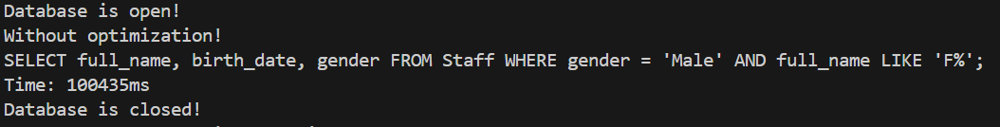
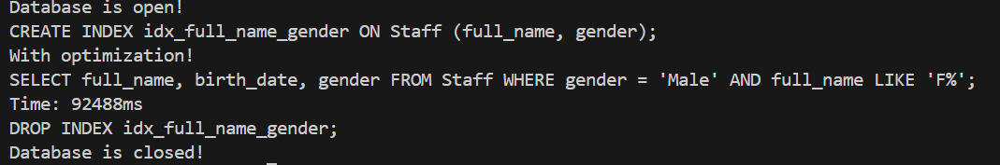

## Введение
Это приложение предназначено для управления справочником сотрудников с использованием базы данных SQLite. Оно позволяет создавать таблицы, добавлять записи, выводить данные и выполнять выборки с различными критериями.

**Основные возможности приложения:**
* Создание таблицы сотрудников
* Добавление записи о сотруднике
* Вывод всех записей сотрудников из таблицы
* Автоматическое заполнение базы данных
* Выборка по критериям
* Оптимизация базы данных


## Структура проекта:

```text
.
├── bin
├── include
│   ├── DatabaseHadler.cpp
│   ├── Staff.hpp
│   ├── Timer.hpp
│   └── Utils.hpp
|
├── src
│   ├── DatabaseHandler.cpp
│   ├── Staff.cpp
│   ├── Timer.cpp
│   ├── Utils.cpp
│   └── main.cpp
|
└── CMakeLists.txt
```
## Установка пакетов (Linux, при необходимости)
1. **Установка SQLite3 и libSQLite3:**  
* Для Debian/Ubuntu:

    ```bash
    sudo apt-get install sqlite3 libsqlite3-dev
    ```
* Для CentOS/Fedora/RedHat:

    ```bash
    sudo yum install sqlite sqlite-devel
    ```  
* Для Arch:  

    ```bash
    sudo pacman -S sqlite
    ```  
2. **Установка компилятора GCC:**
* Для Debian/Ubuntu:

    ```bash
    sudo apt-get install gcc
    ```
* Для CentOS/Fedora/RedHat:

    ```bash
    sudo yum install gcc
    ```  
* Для Arch:  

    ```bash
    sudo pacman -S gcc
    ```  
3. **Установка CMake:**
* Для Debian/Ubuntu:

    ```bash
    sudo apt-get install cmake
    ```
* Для CentOS/Fedora/RedHat:

    ```bash
    sudo yum install cmake
    ```  
* Для Arch:  

    ```bash
    sudo pacman -S cmake
    ```  

4. **Проверка установленных пакетов**:
    
    Для проверки установки SQLite3
    ```bash
    sqlite3 --version
    ```
    Для проверки установки GCC
    ```bash
    gcc --version
    ```
    Для проверки установки CMake
    ```bash
    cmake --version
    ```

## Установка и запуск

### Требования:
* SQLite3
* Компилятор C++ (например, GCC)
* C++ 20
* CMake (для сборки проекта)  
[Установка пакетов](#установка-пакетов-linux-при-необходимости)

### Установка:

1. **Клонирование репозитория:**
   ```bash
   git clone https://github.com/Ildarc4S/Work-with-SQL.git
   cd Work-with-SQL
    ```
2. **Сборка проекта:**
    ```bash 
    mkdir build 
    cd build 
    cmake .. 
    make
    ```
## Запуск программы и описание режимов работы

### Режимы работы:
1. **Создание таблицы сотрудников**
   - Создает таблицу `Staff` в базе данных.
   - Пример запуска:
     ```bash
     ./../bin/SQLApp 1
     ```

2. **Добавление записи о сотруднике**
   - Ожидает параметры: ФИО (в формате "Фамилия Имя Отчество"), дата рождения (в формате YYYY-MM-DD), пол (Male/Female).
   - Пример запуска:
     ```bash
     ./../bin/SQLApp 2 "Ivanov Petr Sergeevich" "1989-01-23" "Male"
     ```

3. **Вывод всех записей сотрудников**
   - Выводит все уникальные записи из таблицы `Staff`, отсортированные по ФИО.
   - Пример запуска:
     ```bash
     ./../bin/SQLApp 3
     ```

4. **Автоматическое заполнение базы данных**
   - Заполняет таблицу `Staff` 1'000'000 строками с равномерным распределением пола и начальной буквы ФИО, включая 100 строк с мужским полом и фамилией, начинающейся на "F".
   - Пример запуска:
     ```bash
     ./../bin/SQLApp 4
     ```

5. **Выборка по критериям**
   - Выполняет выборку из таблицы по критериям: пол мужской и фамилия начинается с "F". Замеряет время выполнения.
   - Пример запуска:
     ```bash
     ./../bin/SQLApp 5
     ```

6. **Оптимизация базы данных**
   - Оптимизирует работу с базой данных и производит выборку по тем же критериям, замеряя время выполнения.
   - Пример запуска:
     ```bash
     ./../bin/SQLApp 6
     ```

### Разница запроса с оптимизацией и без:
**Без оптимизации:**


**С оптимизацией**
